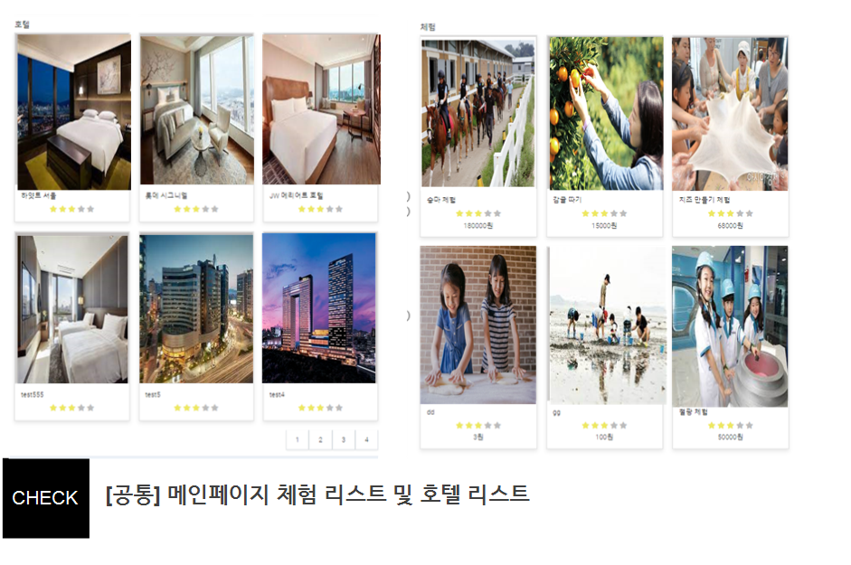
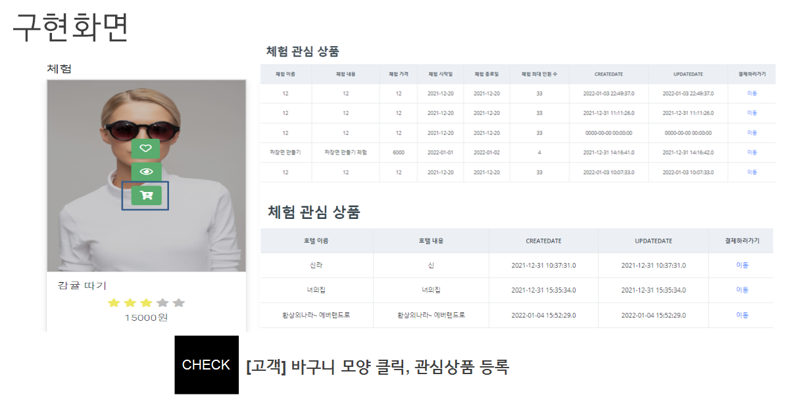
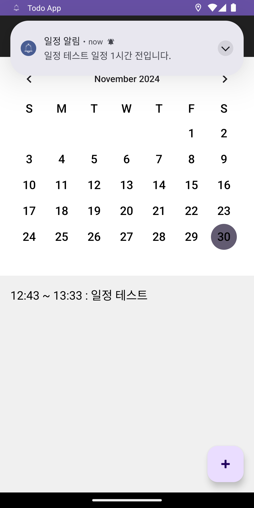
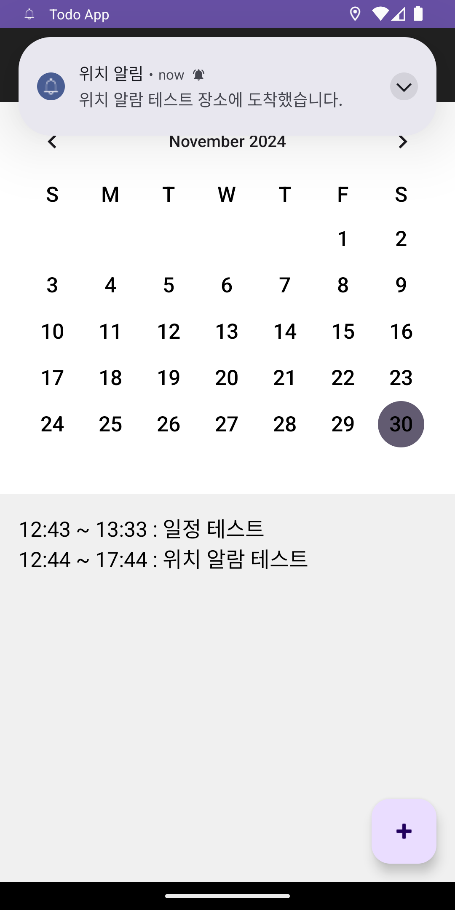

# 📜 배지환's Portfolio

#### "기술을 활용해 복잡한 문제를 해결하고, 실질적인 변화를 만들어가는 데 열정을 가진 개발자입니다."

## ✋ Introduce

  + 이름: 배지환  
  + 생년월일: 1999년 04월 14일  
  + 학교: 서원대학교 컴퓨터공학과   
  + 이메일: m9310142@naver.com  
  + github: https://github.com/jihwan20

## 🛠️ Skill

>+ 언어 

>+ 데이터베이스 

>+ 백엔드 

>+ 프론트엔드 

>+ IDE 및 플랫폼 

## ✏️ Education

>두원공과대학교(2년제) - 컴퓨터공학과/학사(졸업)  
>2018.03 - 2021.06  

>국비지원교육 -  공공데이터 융합 자바/스프링 개발자 양성과정(수료)  
>2021.07 - 2022.01  

>서원대학교(4년제) - 컴퓨터공학과/학사(졸업예정)  
>2023.03 - 2025.02

# 💻 Project

## 1. CAST : 호텔 및 축제 예약 추천 사이트(팀프로젝트)

> 역할: 고객 로그인, 고객 결제 월별 차트, 결제 알림 서비스  
> 주요기능: 호텔예약, 결제, 축제추천, 장바구니 등록  
> 기술스택:
>+ IDE :  Spring Tool Suite 4
>+ 데이터베이스: MariaDB
>+ BackEnd: Java, SQL
>+ FrontEnd: jQuery, JavaScript, Ajax, Bootstrap4
>+ Frameworks: Spring Framework, MyBatis
>+ Libraries: Lombok, JSTL

## 구현화면

 

<b>
<호텔 및 축제 목록>
</b> 

 

<b>
<장바구니 추가 기능>
</b>  

> [github](https://github.com/tjdekf112/A2)

## 2. 일정관리 애플리케이션

> 주요기능: 일정등록, 1시간전 알림, 위치기반 알림  
> 기술스택:
>+ IDE :  Android Studio
>+ 데이터베이스: SQlite
>+ BackEnd: 로컬 데이터 처리를 위한 SQLite
>+ FrontEnd: XML 기반 UI 디자인
>+ Libraries: Google map Api

## 구현화면
<table>
  <tr>
    <td align="center">
        
    </td>
    <td align="center">
        
    </td>
  </tr>
  <tr>
    <td>
      <b>
<1시간전 알림 기능>
</b>
    </td>
    <td>
      <b>
<위치기반 알림 기능>
</b>
    </td>
  </tr>
</table>

> [github](https://github.com/jihwan20/Capstone_Todo)

